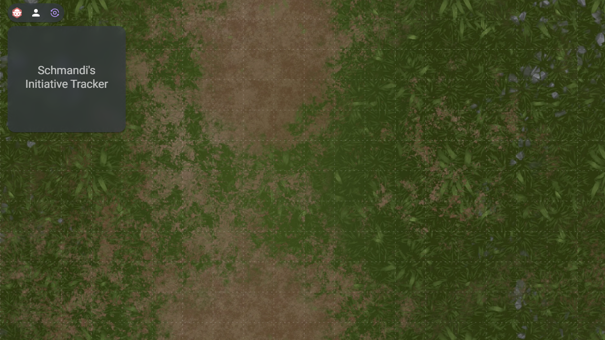
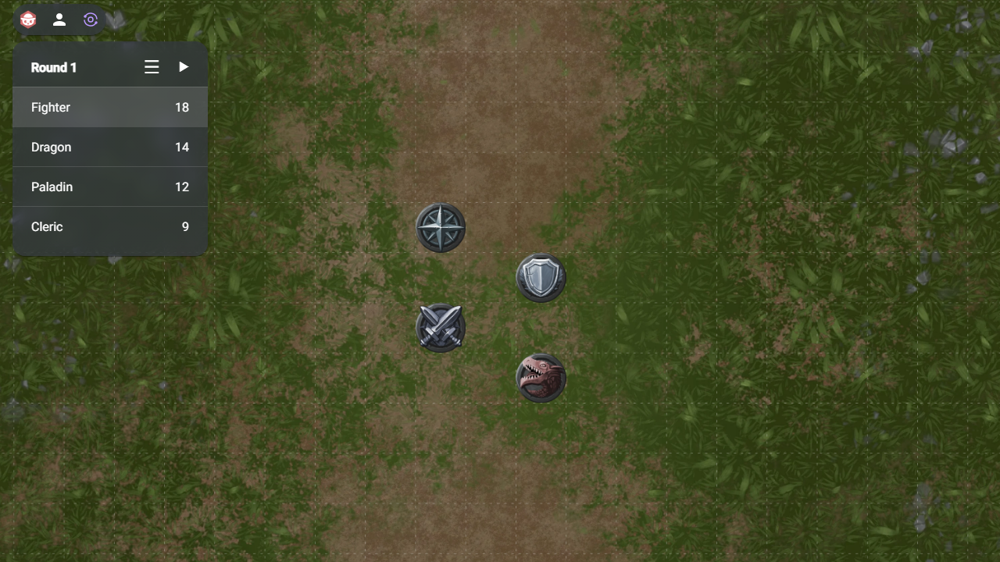
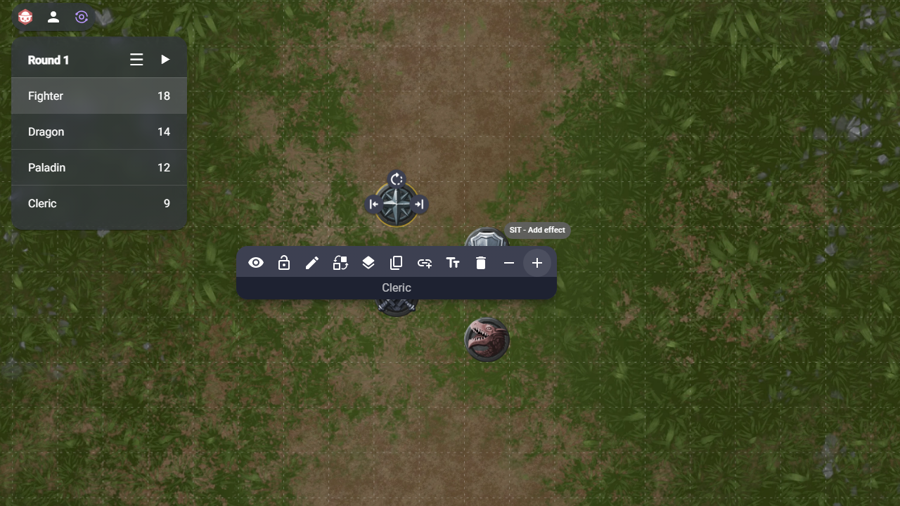
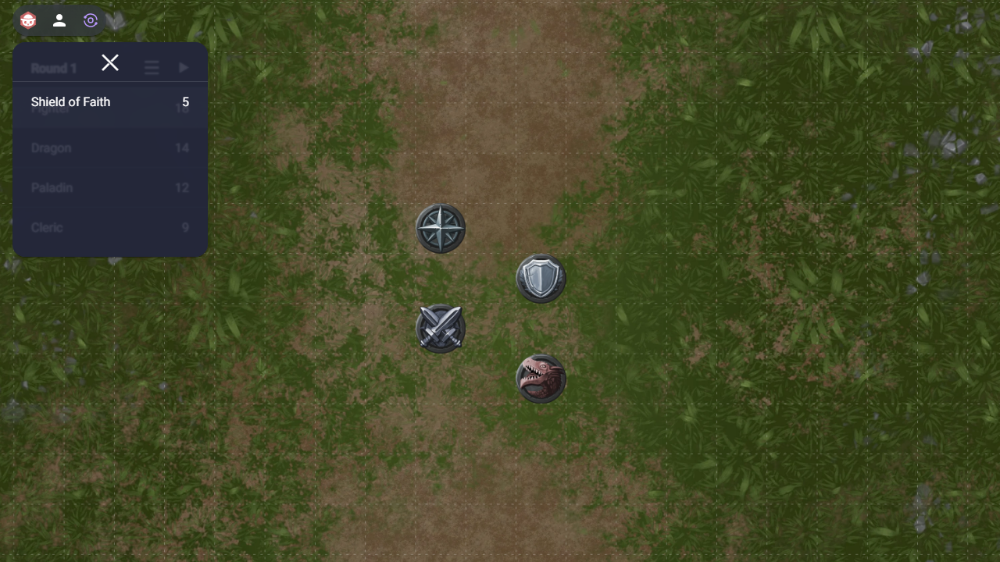

# Modifed Schmandi's Initiative Tracker

A basic Initiative and Effects Tracker extension for [owlbear.rodeo](https://www.owlbear.rodeo/)

The modified verison, contains improvement of life changes and new features. 

This is a selfhosted plugin, i've modfied to fit my own needs, and is not meant to take credit away from the developer of the original plugin, i just had a need to a comprehesive initiative and effect tracker, which the original was a good base for.

## Features of the origianl SIT

Add tokens to the initiative list!

Manage the characters initiative and the current battle round!

Add a characters effect and manage their duration!

Get notified when effects fade away!

